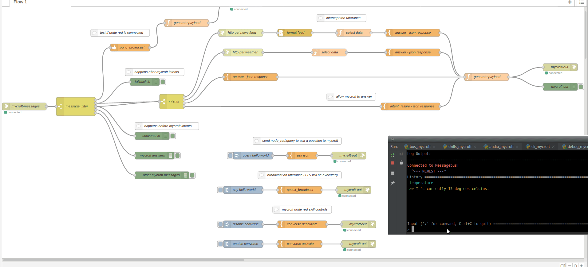
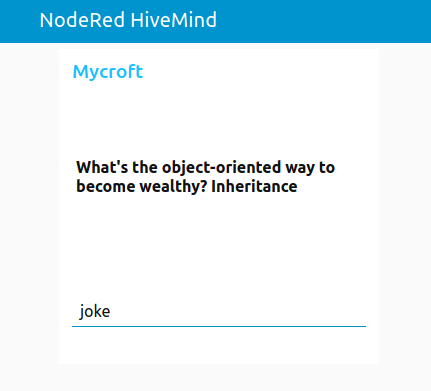

# NodeRed Hivemind

check the [Node Red Mycroft skill](https://github.com/JarbasAl/fallback-node-red) for details

# Usage

flows should open a websocket connection to communicate with mycroft

    ws://username:secret@127.0.0.1:6789

